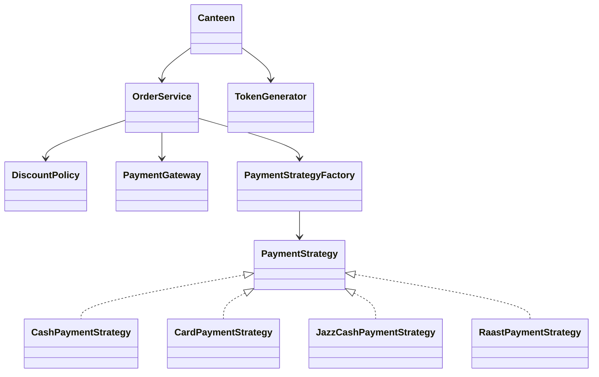

# CampusEats Cafeteria Pre-Order System

Java 17 Maven project for the Software Construction & Development lab.

## Personalised values
- Registration number: SE221107
- D = 7
- Loyalty threshold = 10 + D = 17 past orders
- Loyalty discount = 5 + D = 12%
- RAAST fixed fee = D + 5 = Rs. 12
- Bulk discount = 5% when subtotal is greater than Rs. 1000

## Build and test

```bash
mvn clean test
mvn verify
```

The Maven build includes JUnit 5, Mockito, Checkstyle, and a GitHub Actions CI workflow.

## Processing order

1. Validate the order and quantities.
2. Calculate the menu subtotal.
3. Apply the bulk discount when subtotal > Rs. 1000.
4. Apply the 12% loyalty discount when pastOrders >= 17.
5. Apply the selected payment strategy.
6. Charge the resulting amount through PaymentGateway.
7. Generate the order token.

## Payment design

Payment is represented by PaymentStrategy. PaymentStrategyFactory uses a registry to select Cash, Card, JazzCash, or RAAST without changing OrderService when another strategy is added.



## Tests

The test suite covers characterization behaviour, loyalty boundaries (16/17/18), the Rs.1000 bulk boundary, empty orders, unknown items, payment gateway interaction, and one unit test for each payment strategy.
