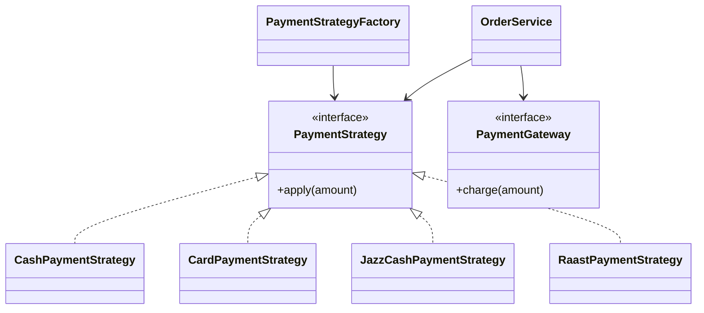

# CampusEats

Java 17 Maven implementation of the CampusEats pre-order system.

## Personalisation
Registration: `SE221107`

Last digit `D = 7`.

- Loyalty threshold: `10 + D = 17` past orders.
- Loyalty discount: `5 + D = 12%`.
- RAAST fixed fee: `D + 5 = Rs. 12`.
- Bulk discount: 5% when the pre-discount subtotal is strictly greater than Rs.1000.
- Loyalty discount is applied after the bulk discount and before the payment surcharge.

## Build and test
```bash
mvn clean test
mvn verify
```

## Design
`OrderService` calculates subtotal and applies discounts. Payment-specific behaviour is implemented by `PaymentStrategy` implementations selected by `PaymentStrategyFactory`. `PaymentGateway` is injected so Mockito can verify exactly one charge.

## Boundary behaviour
- `pastOrders = 16`: no loyalty discount.
- `pastOrders = 17`: 12% loyalty discount.
- `pastOrders = 18`: 12% loyalty discount.
- Empty orders throw `IllegalArgumentException`.
- Unknown menu items throw `IllegalArgumentException`.

## UML


## Submission notes
Repository: `https://github.com/musaddiqse221107/scd-lab-final--se221107-.git`
Final commit hash: fill from `git rev-parse HEAD` after the last push.
